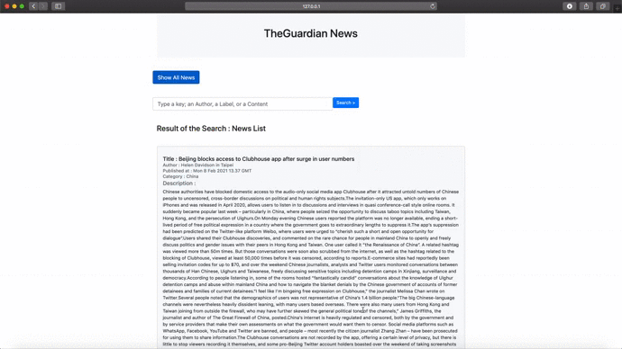
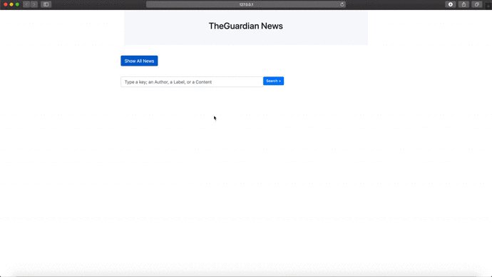

# TheGuardian News Scraper

  

  

[Description](#description) <br>

[Screenshot](#screenshot) <br>

[Demo](#demo) <br>

[Installation](#installation) <br>

[Usage](#usage) <br>

[About](#about)<br>

[Technologies](#technologies)

  

## Description

  

The goal of this Project is to create a solution that crawls for articles from a news website, cleanses the response, stores it in a mongo database, then makes it available to search via an API. illustrating the use of the following:

*  Scrapy (scraping and crawling framework)

* Flask (micro web development framework)

The project is split up into two subprojects. We firstly scrape theguarduan news website to get news articles we are interesting in. then we Store the data in [MongoDB Atlas](https://www.mongodb.com/cloud/atlas%22%20%5Ct%20%22_blank), a hosted Mongo database,

The second subproject corresponds to an API that provides access to the content in the mongo database. And allow as to search the articles' text by keyword.

  
##  Screenshot


  

## Demo


 
 
 

 

  

## Installation


Use the package manager pip to install required libraries.

```bash

pip install -r requirements.txt

```

## Usage


To start scraping, make sure to create a cluster in [MongoDB Atlas](https://www.mongodb.com/cloud/atlas) and use your connection credentials.

Update [settings.py](https://github.com/souka1/TheGuardian-Web-Scrapper/blob/master/theguardian/settings.py)


```bash


MONGO_URI = 'Connection URI'

MONGO_DATABASE = 'Database Name'

```
Update [API.py](https://github.com/souka1/TheGuardian-Web-Scrapper/blob/master/theguardian_API/API.py)

```bash

MONGO_URI = 'Connection URI'
```
To lunch the Spider, run the command :
```bash
scrapy crawl news
```
This opetation will take some time and after its execution a number of news article will exist in the test collection of the  mongodb test database.

To lunch the flask API, run the command :
```bash
cd theguardian_API
env FLASK_APP=API.py flask run
```

  

  

  

## About

  

### Scraping

  
The scrapy spider extracts the following attributes from news articles :

- Headline

- Author

- Content

- Category

- Date of publishing


  

### Data

  

This information is later being stored to test.test collection of mongodb database by the implemented pipeline.

  

### API Endpoints

  


|Method|Endpoint  |Functionality |
|------|--------------------------------------|------------------------------------------|
|GET  |/                                                     |get the home page |
|GET |/showall  |List all article scrapped  |
|POST  |/search?text |Search for article by text.  |
  

  

## Technologies

  
                

